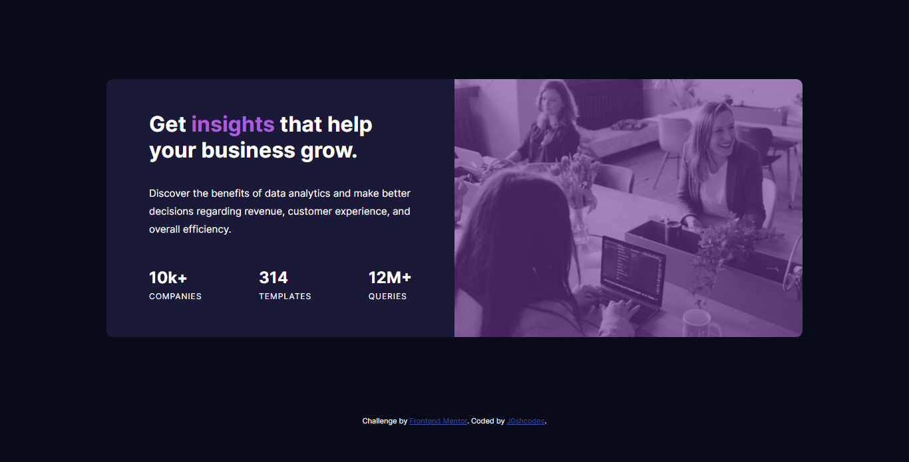

# Frontend Mentor - Stats preview card component solution

This is a solution to the [Stats preview card component challenge on Frontend Mentor](https://www.frontendmentor.io/challenges/stats-preview-card-component-8JqbgoU62). Frontend Mentor challenges help you improve your coding skills by building realistic projects. 

## Table of contents

- [Overview](#overview)
  - [The challenge](#the-challenge)
  - [Screenshot](#screenshot)
  - [Links](#links)
- [My process](#my-process)
  - [Built with](#built-with)
  - [What I learned](#what-i-learned)
  - [Useful resources](#useful-resources)
- [Author](#author))

## Overview

### The challenge

Users should be able to:

- View the optimal layout depending on their device's screen size

### Screenshot



Add a screenshot of your solution. The easiest way to do this is to use Firefox to view your project, right-click the page and select "Take a Screenshot". You can choose either a full-height screenshot or a cropped one based on how long the page is. If it's very long, it might be best to crop it.

Alternatively, you can use a tool like [FireShot](https://getfireshot.com/) to take the screenshot. FireShot has a free option, so you don't need to purchase it. 

Then crop/optimize/edit your image however you like, add it to your project, and update the file path in the image above.

**Note: Delete this note and the paragraphs above when you add your screenshot. If you prefer not to add a screenshot, feel free to remove this entire section.**

### Links

- Solution URL: [My solution](https://github.com/J0shcodes/stats-preview)
- Live Site URL: [Live site](https://j0shcodes.github.io/stats-preview/)

## My process

- Started out first with the HTML template.
- Moved on to the design of the webpage using CSS and Flexbox.
- Made changes on the fly to the HTML template when needed. 

### Built with

- Semantic HTML5 markup
- CSS custom properties
- Flexbox
- CSS Grid
- Mobile-first workflow

### What I learned

I learned how to use the CSS flexbox column and column-reverse property to rearrange the order of elements on the webpage.

```css
.card {
    flex-direction: column-reverse;
    align-items: center;
  }

.stats {
    flex-direction: column;
  }  
```

### Useful resources

- [CSS flex-direction](https://developer.mozilla.org/en-US/docs/Web/CSS/flex-direction) - This helped me to chnage the order of the flex items

## Author

- Website - [J0shcodes](https://github.com/J0shcodes)
- Frontend Mentor - [@J0shcodes](https://www.frontendmentor.io/profile/J0shcodes)
- Twitter - [@Jphleg](https://twitter.com/Jphleg)
